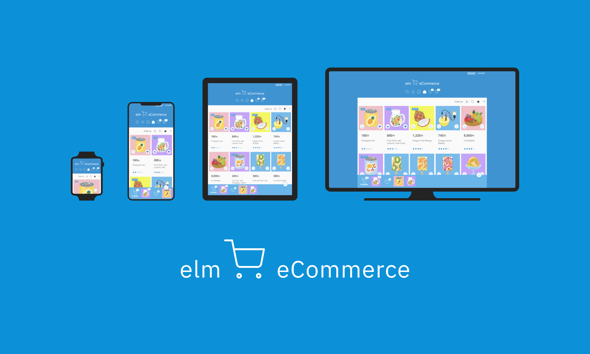

# Elm eCommerce

🍇🍉🍏🍊🍋🍌🍍🍎🍐🍑🍒🍈🍓🥝
                        
A simple eCommerce demo application in 2,500 lines of [Elm](https://elm-lang.org/) code, all shrank into 40KB of JavaScript, including styling and icons.



## Characteristics
* Responsive
* Cart and Favorites management
* Persistent (local storage)
* Synced across tabs
* Light / Dark mode
* Bilingual
* Searchable/Sortable results
* Dashboard (+1,100 lines of Elm)
* Atomic design
* Fault tolerant


## It is made of
```
2,500 lines of Elm
    0 lines of CSS
   25 lines of JavaScript
   15 lines of HTML
```

## Links

* The app demo: https://elm-ecommerce.guupa.com 
* The app + The dashboard demo: https://elm-ecommerce-dashboard.guupa.com
* The app demo in Ellie: https://ellie-app.com/d2dKW5XHVcCa1
* The code: https://github.com/lucamug/elm-ecommerce
* Illustrations (いらすとや): https://www.irasutoya.com/
* Icons: https://feathericons.com/

## Prerequisites

Install [Node.js](https://nodejs.org/).

All other commands should work without installation as they are using `npx`. In case there are some issues you can install the required application executing:

### Optional installations for the development

```
npm i -g elm@0.19.1-5
npm i -g elm-go@5.0.12
```

### Optional installations for building the optimized version to be released

```
npm i -g terser@5.7.0
```

## To set up the development environment

```
git clone https://github.com/lucamug/elm-ecommerce.git
cd elm-ecommerce
cmd/start
```

Then access http://localhost:8000/

Edit `src/Main.elm` and the browser will update automatically.

## To start the Dashboard

```
cmd/startDashboard
```

Then access http://localhost:8001/

Edit `src/Dashboard.elm` and the browser will update automatically.

## To build an optimized version

```
cmd/build
```

This will create two folders, `build/normal` and `build/dashboard` that can be used to publish the application.

You can see these two versions of the application here:

* https://elm-ecommerce.guupa.com
* https://elm-ecommerce-dashboard.guupa.com


# **❤️😃 HAPPY CODING! 😃❤️**